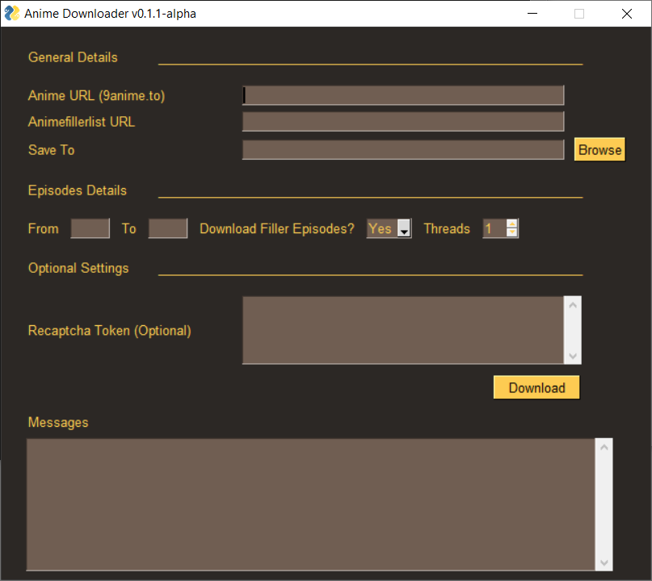
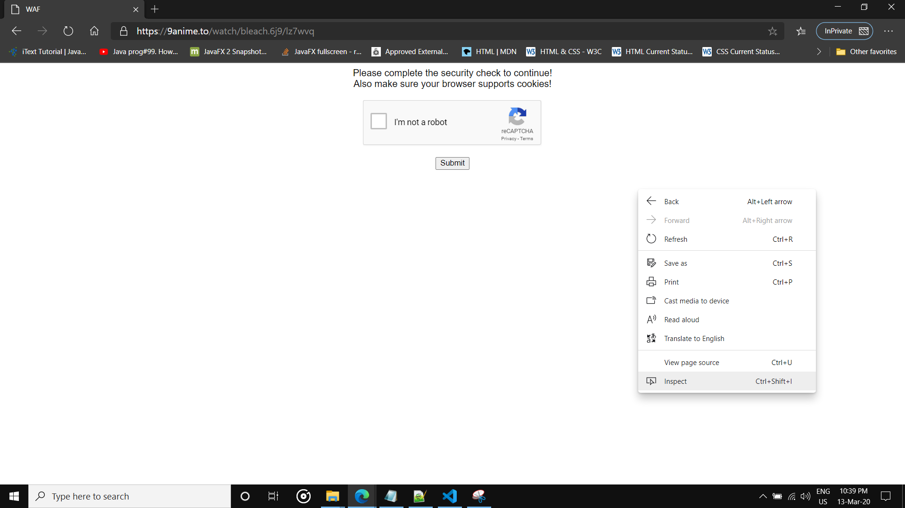
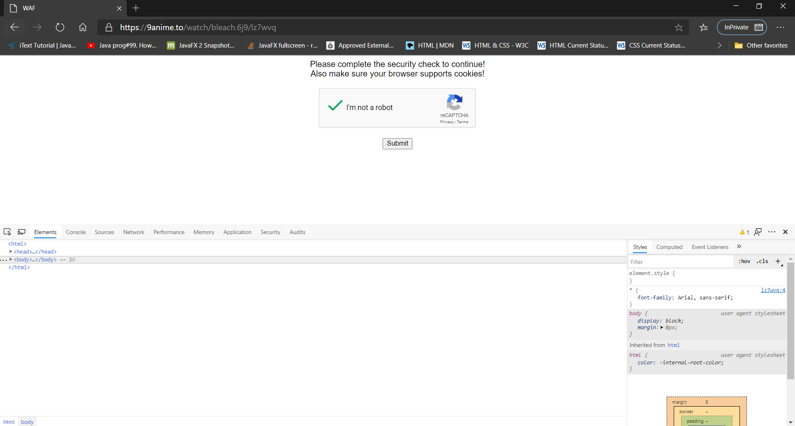
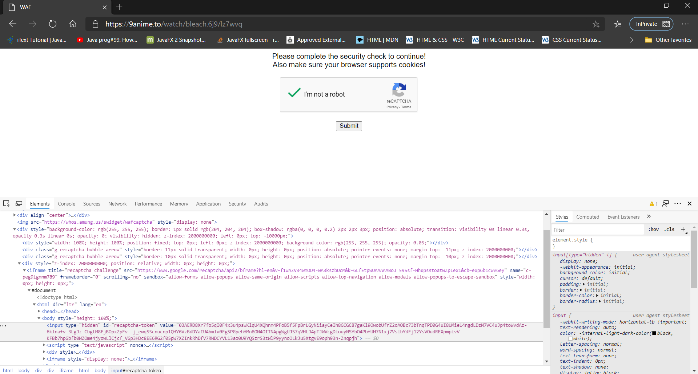

<br>
# Monkey-DL (Anime Downloader) [](https://github.com/Oshan96/Anime-Downloader/releases)

You can now bulk download your favourite anime episodes for various websites, in various resolutions, with or without filler episodes

[See supported websites](#Supported-Websites)

## Donations
If this project is helpful to you and love my work and feel like showing love/appreciation, would you like to buy me a coffee?<br>
<a href="https://buymeacoff.ee/Oshan96" target="_blank"></a>

## Features
* Download Anime from various [supported websites](#Supported-Websites)
* Batch download episodes in the given range at once
* High speed downloads
* Download multiple episodes at once
* Select the resolution (from the available resolutions for the website)
* Select sub/dub (Check whether the website supports selective sub/dub downloads from [here](#Supported-Websites))
* Choose whether filler episodes need to be downloaded or not by selecting "Download fillers" (By providing animefillerlist URL)
* Name the files in "Episode - {episode_number} - {episode_title}" format by providing animefillerlist URL
* Choose the directory files need to be downloaded into
* Custom HLSDownloader (Now FFMPEG installation is optional from v1.0.4 upwards)
* Custom decryptors for encrypted websites

## Supported Websites

#### Note
After v1.0.4 release, Monkey-DL now uses a custom HLSDownloader to download from streams, which is over 10x faster than downloading from FFMPEG. FFMPEG is now optional to be installed in system. FFMPEG will only be used if there is any error occured. So for now, it is safe FFMPEG to be installed as well.
FFMPEG dependency will be removed completely soon in a later release

| Website                                       |Sub/Dub selection      | Need recaptcha token? | Supported resolutions                                         | FFMPEG needed?    | File Size                     | Additional Notes                                                                                  |
|---                                            |---                    |---                    |---                                                            |---                |---                            |---                                                                                                |        
| [9Anime](https://9anime.to/)                  | No                    | Yes                   | Default only                                                  | No                | 500-600MB                     | Will always work, provided token                                                                  |
| [4Anime](https://4anime.to/)                  | No                    | No                    | Default only                                                  | No                | Around 150MB                  | Upon failure, visit 4anime website and restart anime downloader. Fastest downloads                |
| [AnimePahe](https://animepahe.com/)           | No                    | No                    | 720p, 1080p                                                   | No                | 720p: ~150MB, 1080p: ~200MB   | 2captcha API key is needed to download from AnimePahe. Also download speed is capped by host      |
| [Twist](https://twist.moe/)                   | No                    | No                    | 1080p                                                         | No                | 500MB+                        | Files are very high quality and fast downloads. Seems to be raw HorribleSub content               |
| [AnimeFreak](https://www.animefreak.tv/)      | Yes                   | No                    | Default only                                                  | No                | ~90-100MB                     | Downloading from AnimeFreak is generally fast                                                     |
| [GoGoAnime](https://gogoanime.io/)            | No                    | No                    | Mostly 360p, 480p                                             | Optional          | -                             | gogoanime.io and gogoanime.video are supported. gogoanime.pro support will be added in future     |
| [AnimeUltima](https://www.animeultima.to/)    | Yes                   | No                    | Sub: 240p, 360p, 480p, 720p, 1080p<br><br> Dub: Default only  | Optional          | 1080p is 1GB+                 | File sizes are relatively large                                                                   |
| [AnimeFlix](https://animeflix.io/)            | Yes                   | No                    | Sub: 240p, 360p, 480p, 720p, 1080p<br><br> Dub: Default only  | Optional          | 1080p is 1GB+                 | File sizes are relatively large                                                                   |

## Download Anime Downloader [Windows]
> Note : Currently only windows executable is provided (Linux, Mac users go to [Build from source](#Building-from-source))

Download the [Latest Release](https://github.com/Oshan96/Anime-Downloader/releases) from here and extract the zip file

## Downloading Your Favourite Anime

First of all for websites which require capatcha token, Anime Downloader uses [2captcha](https://www.2captcha.com) to bypass google recaptcha, so you need to purchase one ([Check whether your anime website needs captcha token](#Supported-Websites))

Open settings.json and set [2captcha](https://2captcha.com/) API key in "api_key"

```json
"api_key":"insert_2captcha_api_key"
```

*Don't have 2captcha API key? Don't worry! You can still use this to download anime. Check the "FAQ" section on [how to download if you don't have a 2captcha API key](#Q---I-don't-have-a-2captcha-API-key,-is-there-any-workaround-for-that?)*

##### In order to download from some websites (like animeultima.to) Anime Downloader requires you to have [FFMPEG](https://www.ffmpeg.org/) to be downloaded ([Check whether your anime website needs FFMPEG](#Supported-Websites))

- You can download FFMPEG from [here](https://www.ffmpeg.org/download.html)
- And then add the ffmpeg executable to system path
Or, in your linux environment, 
```bash
sudo apt install ffmpeg
```

#### Download failed and weird error came? Don't worry, it's because these websites are protected by various security measures. Simply, just visit the website manually, and restart the anime downloader!

#### Still not able to download? Go ahead and post your issue [here](https://github.com/Oshan96/Anime-Downloader/issues). And I will look into the error and give necessary fixes!

## Running the application
Navigate to the extracted folder and open a cmd or powershell window from that folder and execute "monkey-dl.exe" from command line.

## How to download using GUI version (v0.1.1-alpha upwards)
It is same as the CLI version, but provided a graphical user interface to collect necessary parameters.

Note : After v1.0.4 and anove, Anime Downloader was named as "Monkey-DL" and the executable is called "monkey-dl.exe"

* v1.0.4 and above:
    Execute the "monkey-dl.exe" to start.

* v1.0.3 and lower:
    Execute the "anime-dl.exe" to start.

If you're running from source files, execute the "anime-dl.py" script

```bash
python3 ./anime-dl.py
```

And the GUI will appear as following :



#### Note : If you don't have a 2captcha API key, you need to [provide "Recaptcha Token" in the given text field](#Q---I-don't-have-a-2captcha-API-key,-is-there-any-workaround-for-that?) for websites require captcha token (check FAQ section)

## How to download using anime-dl (CLI)?

First of all, you need to be familiar with the commands you can use with the Anime Downloader.

```
Commands List :
  -h, --help            show this help message and exit
  -u, --url             9Anime.to URL for the anime to be downloaded
  -n, --names           https://www.animefillerlist.com/ URL to retrieve episode titles
  -d, --directory       Download destination. Will use the current directory if not provided
  -s, --start           Starting episode
  -e, --end             End episode
  -c, --code            Recaptcha answer token code. Insert this if you don't have 2captcha captcha bypass api_key
  -t, --threads         Number of parrallel downloads. Will download sequencially if not provided
  -f, --filler          Whether fillers needed (True/False)
```
Above mentioned are the arguments you should use in order to download anime. 

#### The below [FAQ](#FAQ) section provides examples on how to download anime using Anime Downloader

## FAQ

### Q - How can I download one piece anime episodes from 10 to 20?

```bash
./anime-dl.py -u https://9anime.to/watch/one-piece.ov8/169lyx -s 10 -e 20 -n https://www.animefillerlist.com/shows/one-piece 
```

Explantion of the commands used : 
1) -u https://9anime.to/watch/one-piece.ov8/169lyx  : After the "-u" the 9anime.to url for one piece anime is provided
2) -s 10    : start downloading from 10th episode (included)
3) -e 20    : end downloading at 20th episode (included)
4) -n https://www.animefillerlist.com/shows/one-piece   : Provide the animefillerlist.com url for one piece episodes list (this is required)

### Q - How can I download one piece anime episodes 30 to 70 into "D:\Anime\One Piece" folder?

```bash
./anime-dl.py -u https://9anime.to/watch/one-piece.ov8/169lyx -s 30 -e 70 -n https://www.animefillerlist.com/shows/one-piece -d "D:\Anime\One Piece" 
```

Explanation of commands : 
1) -d "D:\Anime\One Piece"  : Download the episodes into "D:\Anime\One Piece" folder

### Q - How can I download bleach episodes 100 to 130 into "D:\Anime\Bleach" folder and download 4 episodes at once?

```bash
./anime-dl.py -u https://9anime.to/watch/bleach.6j9/lz7wvq -s 100 -e 130 -n https://www.animefillerlist.com/shows/bleach -d "D:\Anime\Bleach" -t 4
```

Explanation of commands : 
1) -t 4  : Perform 4 downloads at once

### Q - How can I download bleach episodes 100 to 130 without filler episodes into "D:\Anime\Bleach" folder and download 3 episodes at once?

```bash
./anime-dl.py -u https://9anime.to/watch/bleach.6j9/lz7wvq -s 100 -e 130 -n https://www.animefillerlist.com/shows/bleach -d "D:\Anime\Bleach" -t 3 -f False
```

Explanation of commands : 
1) -f False  : Avoid downloading filler episodes in the given range (Default : True)

### Q - I don't have a 2captcha API key, is there any workaround for that?
Answer : Yes ofcourse! If you don't have a 2captcha API key to bypass captcha, you can still download your favourite anime!
*But how?*
Follow these steps and you will be up and running in no time!

Let's try it!

> Note : There was a bug in v0.0.2-alpha release regarding this solution, so please download v0.0.3-alpha

> Assumptions : let's assume you want to download bleach episodes as in the previous question

Steps : 
1) Open a private window in the browser (ex: Google chrome)
2) Go to the 9anime url (Bleach page) (https://9anime.to/watch/bleach.6j9/lz7wvq)
3) Now the recaptcha will appear


4) Right click and open inspection mode (ctrl+shift+i for google chrome)




5) Solve the recaptcha appeared on page (DO NOT SUBMIT!)



6) Find the captcha answer from the webpage using inspector



Answer is the "value" of the "input" element with the id "recaptcha-token" (Find for element using this id using ctrl+f to find)
Copy the "value" of the input tag

So the value/recpacha answer is :

<i>"03AERD8Xode9TV-gFkG-7CNkllpKoiXfDKVEZ0Lu9NjGpxVv89bjwNHkS5bcfXHqKXx746tsNW_IUMhSVV7Aym-lcvdn6jd5Ggy1a28AQ_BI1K380joLpYReKB0EOjJjO2oVEUpOgtPu0fgfjxABKpI9EjrDZ0T7iSsKDPfhnXebQcZxIbAwelADkZ8m4qYojn3J_-kQyreIRCEztWyTTpm_SoNt6lIpFxG-egDFqVF6Sg7ICPp0QQrPa5UC-6pecgs_3xspg7PN48VOXGfHH4PCARIaGVL-J5CYNsesqUuZ4t_4kni9euduhtB3KCrV1_IYOhymepwczWIKKPGmze2DKVddoDBABlS8NZaxHRFAzNjjJHOhlRyblBMlmerK_Mu5N25bZeY5ZZ"</i>

Now we have what we need!

All you have to do is, add -c or --code command to the previous example's code like below

```bash
./anime-dl.py -u https://9anime.to/watch/bleach.6j9/lz7wvq -s 100 -e 130 -n https://www.animefillerlist.com/shows/bleach -d "D:\Anime\Bleach" -t 4 -f False -c 03AERD8Xode9TV-gFkG-7CNkllpKoiXfDKVEZ0Lu9NjGpxVv89bjwNHkS5bcfXHqKXx746tsNW_IUMhSVV7Aym-lcvdn6jd5Ggy1a28AQ_BI1K380joLpYReKB0EOjJjO2oVEUpOgtPu0fgfjxABKpI9EjrDZ0T7iSsKDPfhnXebQcZxIbAwelADkZ8m4qYojn3J_-kQyreIRCEztWyTTpm_SoNt6lIpFxG-egDFqVF6Sg7ICPp0QQrPa5UC-6pecgs_3xspg7PN48VOXGfHH4PCARIaGVL-J5CYNsesqUuZ4t_4kni9euduhtB3KCrV1_IYOhymepwczWIKKPGmze2DKVddoDBABlS8NZaxHRFAzNjjJHOhlRyblBMlmerK_Mu5N25bZeY5ZZ
```

### Recaptcha does not appear even in private browsing. What can I do?

Answer :
> Assumptions : let's assume you want to download bleach episodes as in the previous question

This can be solved in 2 steps.

1) Run the anime-dl commands without -c/--code command (like you have a 2captcha key)
This will probably give error, but that's what we need.

2) Now try loading the recaptcha page in private browsing. It will appear!

### I'm getting the error "No module named 'tkinter'". How do I fix this?

Answer : 
> Assumptions : you're trying to run the GUI on Ubuntu (or some other version of it, like Linux Mint)

This can be solved in 2 steps.

1) Open a terminal and type in this command: `sudo apt install python3-tk`

2) Enter your password (it will not be shown)

If the command doesn't work, you may need to run `sudo apt update` first then run the other command again. Once it's installed, the GUI should function correctly.

## Building from source

- Clone the project using to your local machine

### Prerequisites

- Make sure python 3.7+ (preferably the latest version) and pip3 is installed

### Installing

1) Download the dependancies using requirements.txt file

```
pip install -r requirements.txt 
```
2) Rename settings_example.json as settings.json

3) Open settings.json and set [2captcha](https://2captcha.com/) API key in "api_key"

```json
"api_key":"insert_2captcha_api_key"
```

> If you don't have a 2captcha API key purchased, check the "FAQ" section on [how to download if you don't have a 2captcha API key](#Q---I-don't-have-a-2captcha-API-key,-is-there-any-workaround-for-that?)

## Usage

Anime Downloader is a CLI application which takes command line arguments in execution time

Note : The package structure has been changed and the source (working) directory is now "anime_downloader/"

First change your working directory to "anime_downloader/" before running the script

```bash
cd /path/to/anime_downloader/
```

To see the full available commands, run

```bash
python ./Anime_Downloader.py --help
```

```
usage: Anime_Downloader.py [-h] -u <URL> -n <TITLE_URL> [-d <DIR>] [-s <START>]
                           [-e <END>] [-c <TS_NO>] [-t <THREADS>] [-f <ISFILLER>]

Anime Downloader Command Line Tool

optional arguments:
  -h, --help            show this help message and exit
  -u, --url             9Anime.to URL for the anime to be downloaded
  -n, --names           https://www.animefillerlist.com/ URL to retrieve episode titles
  -d, --directory       Download destination. Will use the current directory if not provided
  -s, --start           Starting episode
  -e, --end             End episode
  -c, --code            Recaptcha answer token code. Insert this if you don't have 2captcha captcha bypass api_key
  -t, --threads         Number of parrallel downloads. Will download sequencially if not provided
  -f, --filler          Whether fillers needed (True/False)

```
## Examples

Download One Piece episodes from 130 to 180 without filler episodes into "K:\Anime\One-Piece" folder with episode names (3 simultanious downloads a time)

```bash
python3 ./Anime_Downloader -u https://9anime.to/watch/one-piece.ov8/169lyx -s 130 -e 180 -f False -d "F:\Anime\One-Piece" -n https://www.animefillerlist.com/shows/one-piece -t 3
```


## Authors

* **Oshan Mendis** - *Author* - [Oshan96](https://github.com/Oshan96)

## License

This project is licensed under the MIT License - see the [LICENSE.md](LICENSE.md) file for details

## Acknowledgements 
Anime Downloader wouldn't be possible without these awesome free and opensource projects!
- [CloudScraper](https://github.com/VeNoMouS/cloudscraper)
- [Js2Py](https://github.com/PiotrDabkowski/Js2Py)
- [JsBeautifier](https://github.com/beautify-web/js-beautify)
- [PyCryptodome](https://github.com/Legrandin/pycryptodome)
- [PySimpleGUI](https://github.com/PySimpleGUI/PySimpleGUI)
- [FFMPEG](https://ffmpeg.org/)

Special thanks to [u/sln0913](https://www.reddit.com/user/sln0913) for the awesome logo and banner designs!

## Disclaimer

This software has been developed only for educational purposes by the [Author](https://github.com/Oshan96). By no means this encourage content piracy. Please support original content creators!
